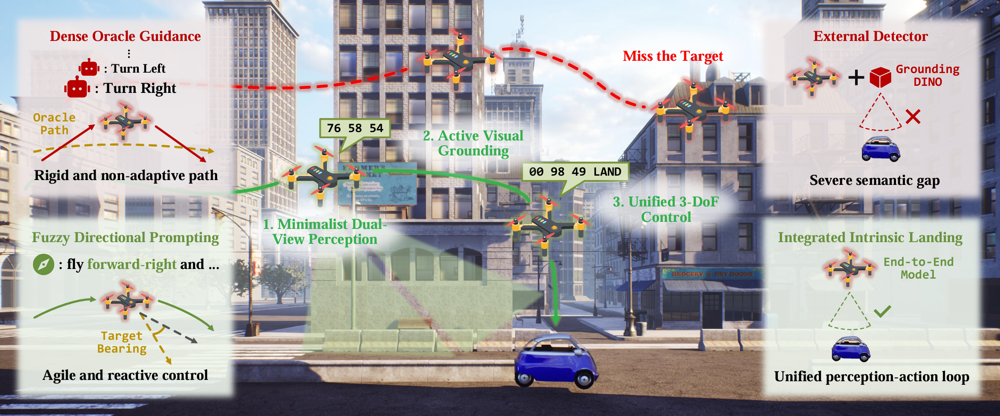

# AerialVLA
Official repository for AerialVLA: A Vision-Language-Action Model for UAV Navigation via Minimalist End-to-End Control

<p align="center">
  
</p>


🔥 **[Check out our Project Page for more demo videos and qualitative results!](https://xupeng23.github.io/AerialVLA)**

## 📖 Abstract
Vision-Language Navigation (VLN) for Unmanned Aerial Vehicles (UAVs) demands complex visual interpretation and continuous control in dynamic 3D environments. Existing hierarchical approaches rely on dense oracle guidance or auxiliary object detectors, creating semantic gaps and limiting genuine autonomy. We propose AerialVLA, a minimalist end-to-end Vision-Language-Action framework mapping raw visual observations and fuzzy linguistic instructions directly to continuous physical control signals. First, we introduce a streamlined dual-view perception strategy that reduces visual redundancy while preserving essential cues for forward navigation and precise grounding, which additionally facilitates future simulation-to-reality transfer. To reclaim genuine autonomy, we deploy a fuzzy directional prompting mechanism derived solely from onboard sensors, completely eliminating the dependency on dense oracle guidance. Ultimately, we formulate a unified control space that integrates continuous 3-Degree-of-Freedom (3-DoF) kinematic commands with an intrinsic landing signal, freeing the agent from external object detectors for precision landing. Extensive experiments on the TravelUAV benchmark demonstrate that AerialVLA achieves state-of-the-art performance in seen environments. Furthermore, it exhibits superior generalization in unseen scenarios by achieving nearly three times the success rate of leading baselines, validating that a minimalist, autonomy-centric paradigm captures more robust visual-motor representations than complex modular systems.

## 🚀 News & Updates

  - **[2026-04]** AerialVLA evaluation code and pre-trained LoRA weights are officially released!

## 🛠️ Installation

**1. Clone the repository:**

```bash
git clone https://github.com/XuPeng23/AerialVLA.git
cd AerialVLA
```

**2. Create a Conda environment and activate it:**

```bash
conda create -n aerial_vla python=3.10 -y
conda activate aerial_vla
```

**3. Install PyTorch:**

> *Note: The following command is for CUDA 11.8. Please adjust it according to your local CUDA version.*

```bash
pip install torch==2.1.2 torchvision==0.16.2 torchaudio==2.1.2 --index-url https://download.pytorch.org/whl/cu118
```

**4. Install the required dependencies:**

```bash
pip install -r requirements.txt
```


## 🌍 Data & Simulation Environment

AerialVLA uses the Unreal Engine-based AirSim simulator and the dataset provided by the TravelUAV benchmark. You do not need to install AirSim separately; simply download the compiled environment binaries.

1.  Follow the [TravelUAV Official Documentation](https://github.com/prince687028/TravelUAV/tree/main) to download the dataset (`dataset_raw`) and the simulation environments (`envs`).
2.  The `data/` directory contains the evaluation JSON files. We have split the original test cases by map to facilitate granular, per-map performance analysis, while **strictly adhering to the original TravelUAV validation splits**.


## 📥 Checkpoints

1.  **Base Model:** AerialVLA is built upon `openvla-7b`. You can download the base weights from Hugging Face and place them in the `./openvla-7b` directory.
2.  **AerialVLA LoRA Weights:** Download our pre-trained LoRA weights from our **[Hugging Face Repository](https://huggingface.co/XuPeng23/AerialVLA)** and place them in `./checkpoints/aerial_vla/`.

## 📁 Project Structure

```text
AerialVLA/
├── airsim_plugin/
├── checkpoints/
├── data/                 
│   ├── meta/             
│   └── uav_dataset/      
├── dataset_raw/
│   ├── BattlefieldKitDesert/     
│   ├── BrushifyCountryRoads/   
│   └── ...               
├── envs/
│   ├── carla_town_envs/     
│   ├── closeloop_envs/
│   ├── extra_envs/
│   └── ...               
├── eval_results/         
├── openvla-7b/
├── scripts/
│   ├── eval_aerialvla.sh 
│   └── metric.sh         
├── src/
│   ├── model_wrapper/
│   └── vlnce_src/
└── utils/                
```

## 🏃‍♂️ Evaluation

**1. Run Closed-Loop Evaluation:**
To evaluate AerialVLA on a specific map, modify the `TASK_ID` in `scripts/eval_aerialvla.sh` and run:

```bash
bash scripts/eval_aerialvla.sh
```

*The model wrapper (`aerialvla_wrapper_ui.py`) includes a UI feature that displays real-time dual-view perception, dynamic prompts, and continuous action outputs during inference.*

**2. Calculate Metrics:**
Once the evaluation is complete, compute the aggregated metrics (SR, OSR, NE, SPL) by running:

```bash
bash scripts/metric.sh aerial_vla
```

*The results will be saved in `eval_results/aerial_vla/evaluation_detailed.csv` and `evaluation_summary_aggregated.csv`.*


## 📋 TODO List

We are continuously working on improving AerialVLA and pushing it towards real-world applications.

- [x] Release inference code and pre-trained weights.
- [ ] Release the training code and curated trainset.
- [ ] Hardware Deployment: Deploy AerialVLA on real-world UAVs for physical testing.

## 📄 License

This project is licensed under the **Apache License 2.0**. See the [LICENSE](LICENSE) file for more details.

## ✒️ Citation

If you find our work helpful for your research, please consider citing our paper:

```bibtex
@article{xu2026aerialvla,
  title={AerialVLA: A Vision-Language-Action Model for UAV Navigation via Minimalist End-to-End Control},
  author={Xu, Peng and Deng, Zhengnan and Deng, Jiayan and Gu, Zonghua and Wan, Shaohua},
  journal={arXiv preprint arXiv:2603.14363},
  year={2026}
}
```
